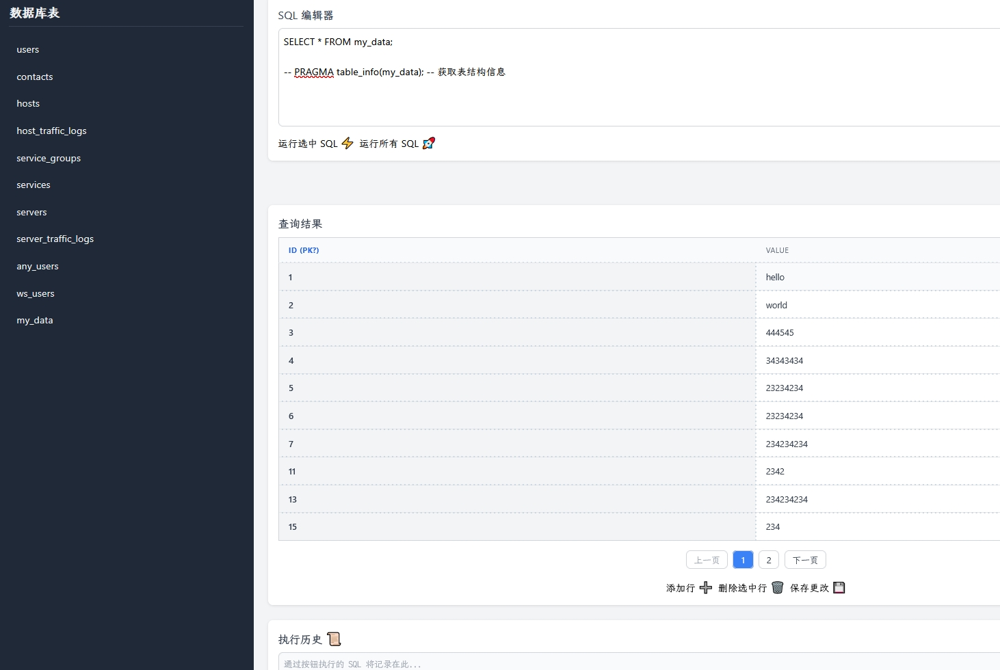

# SQLITEM

根据这个[想法](https://x.com/linexjlin/status/1924723978180165779)实现的一个玩具项目。 这个项目实现了用自然语言写了一个用 web 管理 sqlite3 数据库的想法。 

## 主要实现思路就是： 

`写出想法 -> 让 AI 给出思路及项目框架 -> 检查 AI 给的思路 -> 实现具体的代码`

可以看看自然语言绡的 后端，及前端 prompt： [backend.prompt.md](./backend.prompt.md), [frontend.prompt.md](./frontend.prompt.md)

## 实现效果：

## 一些经验

- 后端口实现的统一接口很重要（主要就是这行文字： `给出 API 请求例子`）。  有了统一的接口前端就能独立生成了。 
- 后端代码，我每次都是重新生成。 
- 前端代码我在 gemini 用了 canvas 修改了几个版本，最后，再更新文档。 
- 我用 gemini 2.5 pro 每次生成的代码基本直接可用，不能用的不要花时间 debug 直接重新生成。 